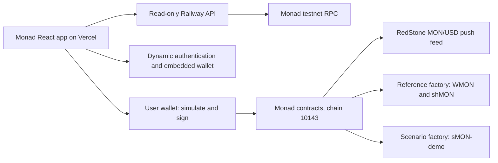

# Architecture and asset decisions

## Runtime boundaries

The API observes contracts and returns bounded public data. It never signs for users. The wallet verifies network/account, target code and factory provenance, obtains exact token allowances when needed, simulates, estimates gas and waits for two confirmations. A transaction hash survives a browser reload so a pending action is not casually sent twice. Final execution can still revert if price, capacity or state changes; the contract is authoritative.

The scenario and reference factories have separate CompositeOracle deployments and token registries. Controlled scenario prices cannot value WMON or shMON. The test vault's underlying is a fixed synthetic dollar unit, even where its shares back externally priced WMON.

## Assets selected after actual RPC checks

| Item                    | Decision and evidence                                                                                                                                                                                                                            |
| ----------------------- | ------------------------------------------------------------------------------------------------------------------------------------------------------------------------------------------------------------------------------------------------ |
| WMON                    | The older circulated testnet address `0x760AfE86e5de5fa0Ee542fc7B7B713e1c5425701` returned no code. Deploy an explicit YieldShield wrapper instead; deposit/withdraw maps one native testnet MON to one WMON.                                    |
| TestUSDC                | Use an independently named six-decimal test asset. Circle testnet USDC exists, but its faucet was not provisioned for this application. No Circle integration is claimed.                                                                        |
| shMON                   | Use the official testnet address `0x282BdDFF5e58793AcAb65438b257Dbd15A8745C9`; bytecode, symbol, decimals and conversion methods were read. Native deposit uses shMonad's payable deposit interface.                                             |
| Historical Pyth adapter | Retained at `0x2880aB155794e7179c9eE2e38200202908C17B43` and MON/USD ID `0x31491744e2dbf6df7fcf4ac0820d18a609b49076d45066d3568424e62f686cd1`. On-chain price was stale during setup. Current signed updates require authenticated Hermes access. |
| vTestUSDC               | Own test vault accounts actual deposits and deliberately funded test yield, limits each contribution and total NAV growth, and ignores unsolicited transfers when computing NAV. It does not represent Morpho or an external lending strategy.   |
| sMON-demo               | Separate fixed-supply test asset with an 8-minute deterministic baseline/+25%/baseline/−25% cycle. Not Kintsu sMON.                                                                                                                              |

The active RedStone adapter pins the official MON/USD feed `0x92B14C0531A1f8fC0F85712FaF97d7302B4128C8`, verifies 8 decimals and description, and rejects nonpositive, incomplete, future or older-than-120-second rounds. Deployment verification checks its runtime and factory feed wiring. Provider-aggregated rounds have no Pyth confidence or EMA fields; those checks are not claimed. shMON uses the lower of `convertToAssets` and `previewUnstake`, multiplied by MON/USD. Upward NAV growth is bounded against the deployment reference; declines remain visible.

The historical Pyth adapter remains separately identified and unused by the active reference factory. Its confidence and EMA policies remain in that attributed source. The Pyth free trial excludes MON and paid ongoing access was not selected; RedStone removes that operational dependency.

Dynamic React SDK 5.8.0 supplies built-in email authentication, embedded-wallet creation and confirmation screens. It loads when onboarding is opened and restores an existing selected Dynamic session on reload. The current headless JS SDK was evaluated; the built-in React UI was selected to retain the provider's authentication and step-up flows. Before signing, the application reacquires the SDK wallet client, checks the selected account and chain, verifies the target, simulates the operation and obtains explicit wallet confirmation. The API has no wallet or Dynamic server key.

Backing-share payout uses current redeemable NAV as its denominator with conservative rounding, then applies the original native-share cap. A cap-denominator shortcut would overpay when share value rises and is deliberately avoided.

## Preserved protocol behavior

The imported immutable pool/factory modules preserve the original storage layout. Monad's initialization adapter delegates to the pinned original initializer and overrides only the two demonstration timing slots for the pinned asset combinations on testnet. Factory bootstrap is finalized. Governance uses the imported governor and a 48-hour timelock; the API is not an administrator.

An asset exit needs a usable protected-asset fee price. A backing exit additionally needs strict backing valuation and the protected-exit delay. Junior notice is a maturity timestamp, with an inclusive seven-day withdrawal window. Available backing is still constrained by active protection. Partial senior withdrawal settles fees on the entire position, burns the old receipt, and creates a proportionally reduced receipt that retains its original deposit time.

## Scope decisions

Sponsor selection now follows [the sponsor strategy](SPONSOR_STRATEGY.md). Dynamic is the implemented wallet/onboarding integration; it serves a different role from oracle pricing. Kuru execution, an Agora/AUSD mobile journey and a useful Chainlink CRE workflow have explicit feasibility and evidence gates. Kuru/Agora/CRE remain outside the active runtime.

The active UI uses a new workspace rather than modifying the imported historical UI in place. Shared economics and contracts remain attributed. Test trading uses the existing inventory-funded mechanism adapted for the isolated Monad scenario. Kuru is an external discovery link only. No executable Kuru integration, AUSD bounty, tokenized stocks, Morpho strategy, mainnet funded market or AI trading agent is claimed.

## Official references

- [Monad network information](https://docs.monad.xyz/developer-essentials/network-information)
- [Monad oracle directory](https://docs.monad.xyz/tooling-and-infra/oracles)
- [Monad brand kit](https://www.monad.xyz/brand-and-media-kit)
- [RedStone MON testnet feed](https://app.redstone.finance/push-feeds/MON/monadTestnetBoltMultiFeed)
- [Dynamic React SDK](https://www.dynamic.xyz/docs/react/reference/quickstart)
- [Pyth migration requirements](https://docs.pyth.network/price-feeds/core/upgrade/preparing)
- [shMonad addresses](https://docs.shmonad.xyz/addresses/)
- [shMonad exchange-rate mechanics](https://docs.shmonad.xyz/exchange-rate)
- [Circle Monad deployment information](https://www.circle.com/blog/now-available-usdc-cctp-wallets-and-contracts-on-monad)

Documentation references were investigated on 9 September 2026. Recorded RPC results and deployment manifests take precedence over an unverified address copied from a web page.
